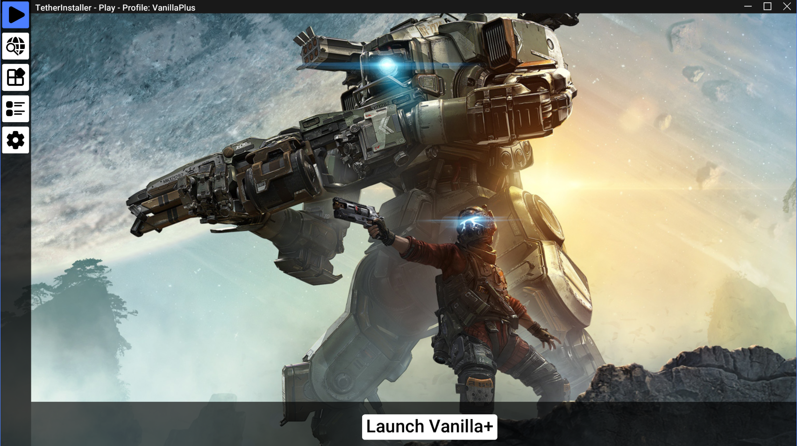
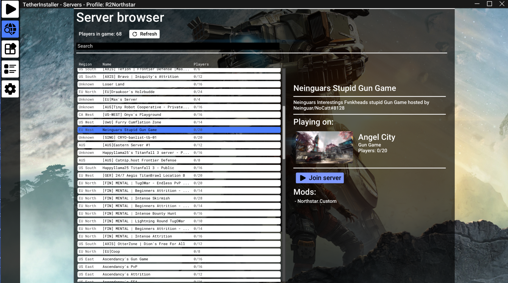

# Tether installer

The Tether installer is an auto updater and mod manager for the
[Northstar modding framework for Titanfall 2](https://github.com/R2Northstar/Northstar).
It is made using [KlemmUI](https://github.com/Klemmbaustein/KLemmUI)
and is avaliable for Windows.

## Download

You can find pre-packaged releases of the installer
[here](https://github.com/Klemmbaustein/TetherInstaller/releases/tag/v1.1.1).

## Features

- Launching and installing of [Northstar](https://github.com/R2Northstar/Northstar).
- A mod browser for browsing and installing mods hosted on
- [thunderstore.io](https://northstar.thunderstore.io/).
- Support for installing Northstar prerelease versions and the
[Vanilla+ mod](https://northstar.thunderstore.io/package/NanohmProtogen/VanillaPlus/)
which enables the use of Northstar mods on Respawns vanilla servers.
- An in-app server-browser that automatically downloads any required mods before joining a server.
- Managing of Northstar profiles.

## Building the installer from source

If you want to contribute to the installer, you will need to download and compile the source code.

First, clone the repository with submodules. 
`git clone --recurse-submodules https://github.com/Klemmbaustein/TetherInstaller.git`

### Windows MSVC:

1. Run `Setup.ps1` with the visual studio developer powershell.
2. Build the solution.

### Linux GNU Makefile:

1. Install cURL on your system.
2. Follow [The steps detailed here](https://github.com/Klemmbaustein/KlemmUI#readme)			
   to install the KlemmUI library on your system.
3. Run `make` in the `NorthstarInstaller` directory.
